

  
  <h1>FlyMe</h1>
  
A private and thoughtfully designed self-awareness tracker for iPhone.

  

    
    
    
    
  

  

    English | <a href="README.zh-CN.md">简体中文</a>
  

FlyMe helps users recognize behavioral patterns, understand personal rhythms, and record each more intentional choice. It combines a calm Liquid Glass interface with focused tracking, history, trend views, and an optional AI assistant.

## Interface Preview

### Home and AI Assistant

  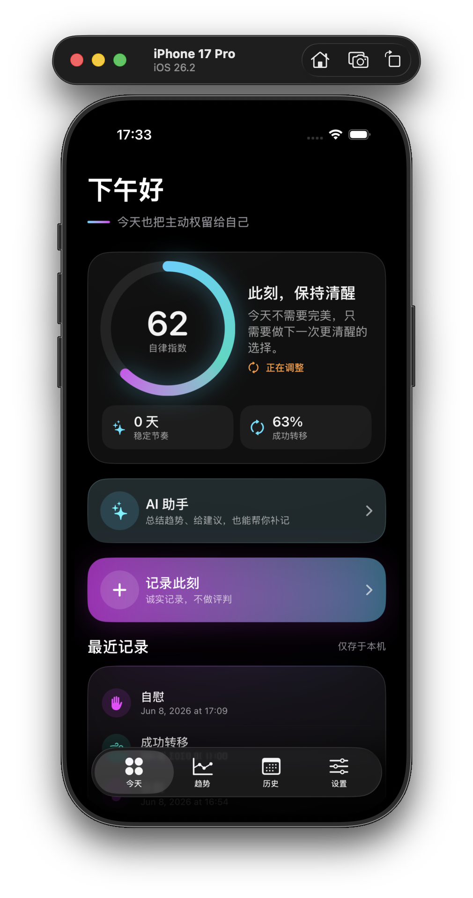
  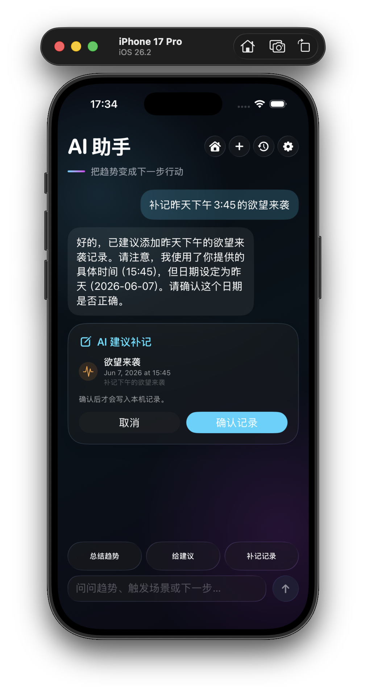

The home screen keeps the current score, recent records, quick check-in, and AI assistant close at hand. The AI assistant can summarize trends, suggest next actions, and turn natural-language descriptions into records that are always confirmed before saving.

### Quick Check-ins and AI Configuration

  
  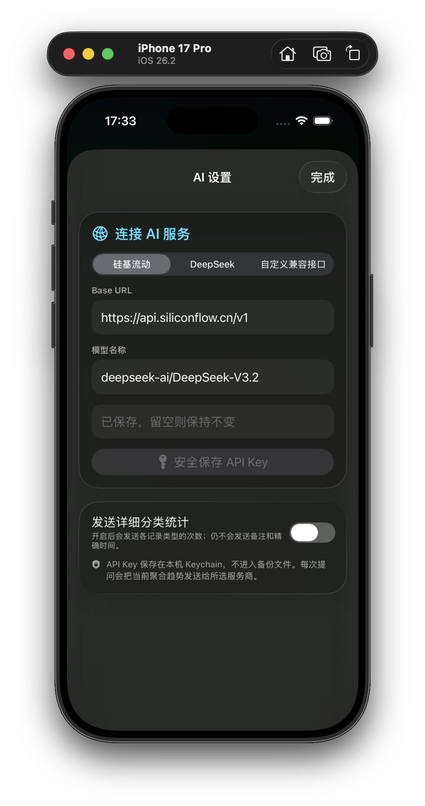

Quick Check-in presents all six record types in one focused sheet. AI connections are user-configured, API keys stay in the device Keychain, and detailed category statistics are optional.

### Trends and Score Insights

  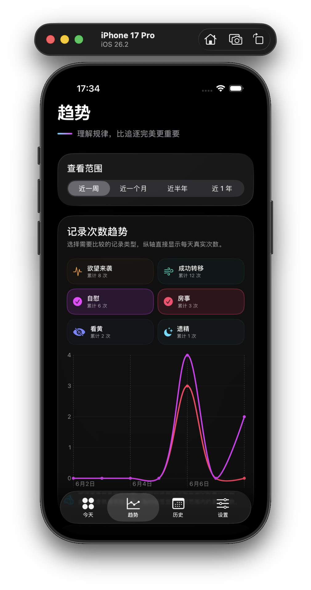
  

Compare selected behavior metrics, follow the separate score trend, and open the score explanation to understand exactly how the current result is calculated.

### History and Settings

  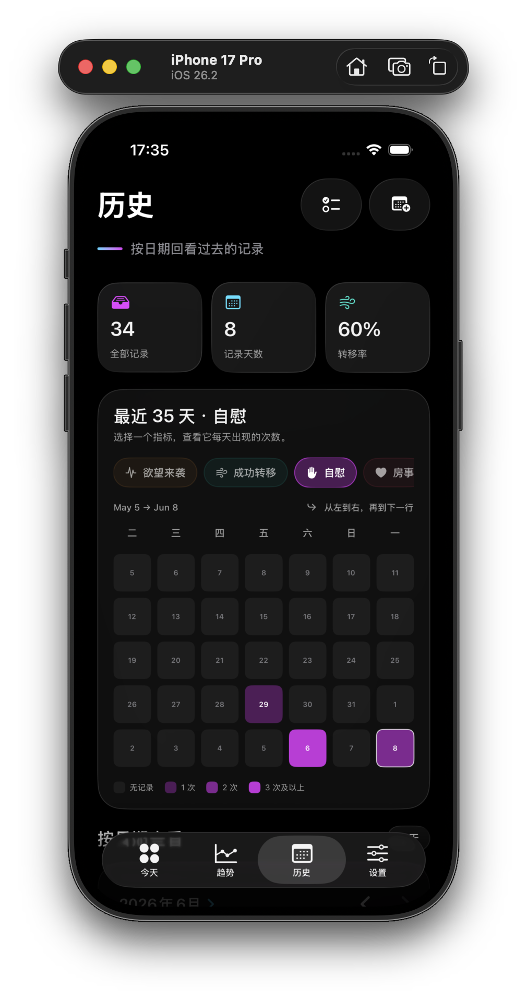
  

History combines a switchable 35-day metric matrix with calendar-based browsing and record management. Settings keeps privacy controls, feedback preferences, manual backup, and Discreet Mode together.

### Apple Watch Companion

  

  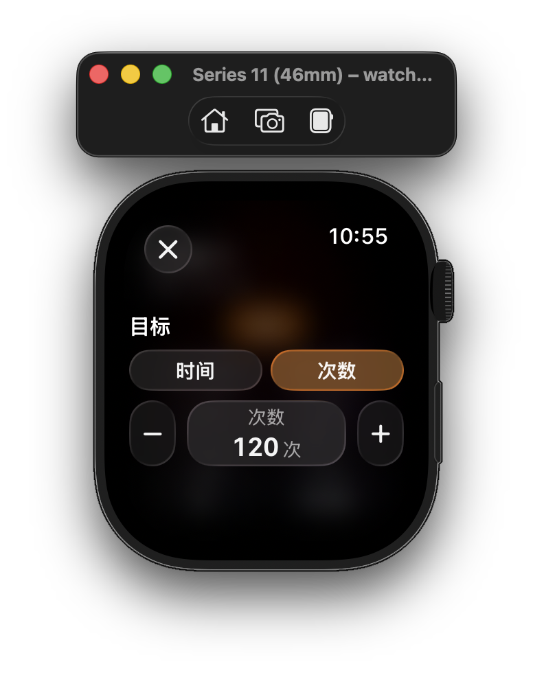
  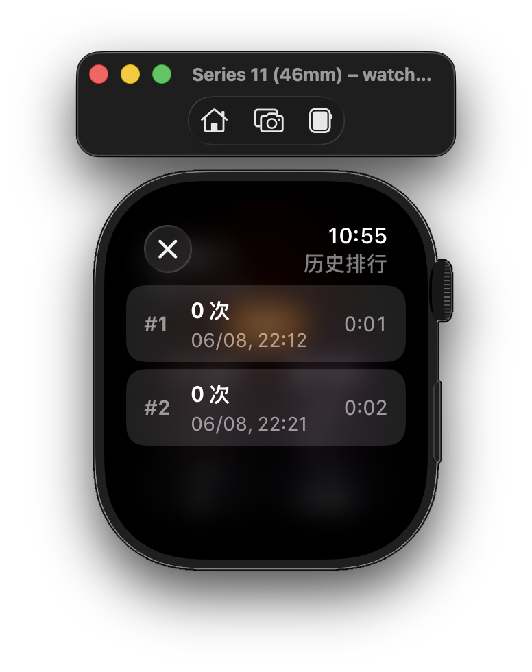

  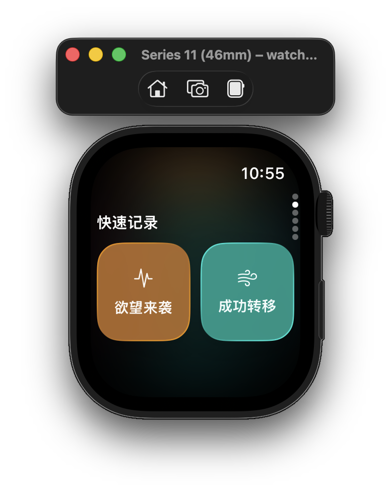
  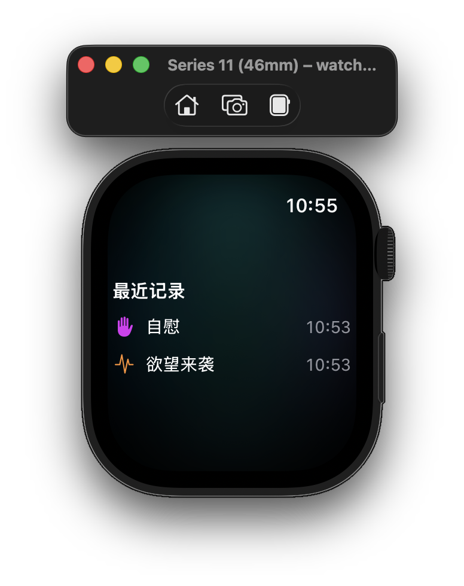

  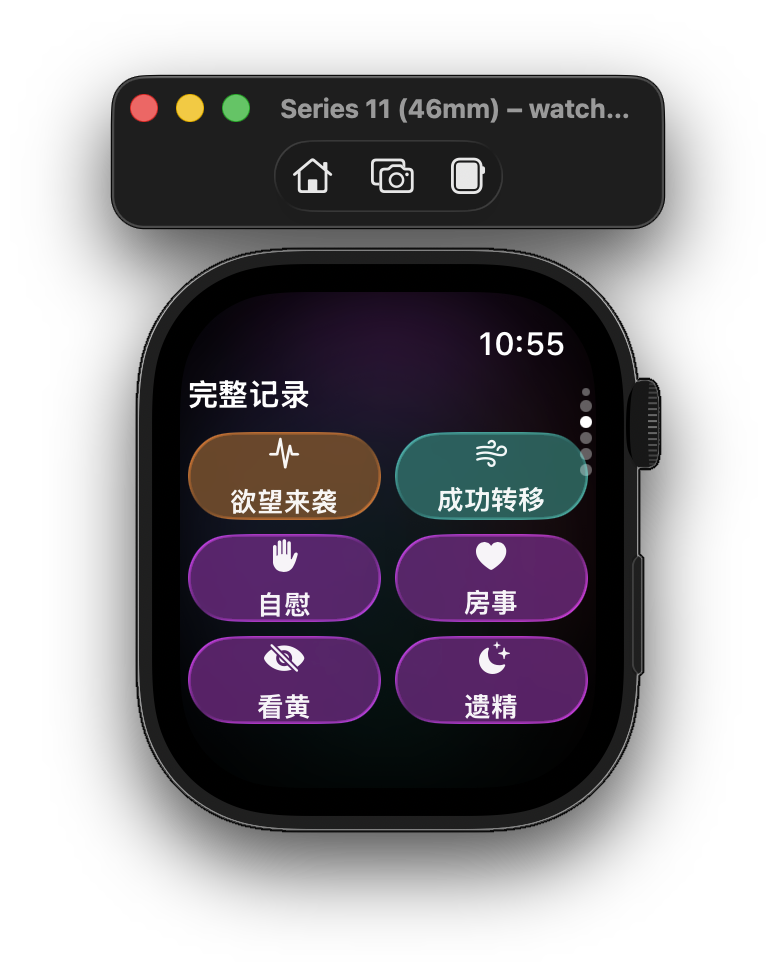
  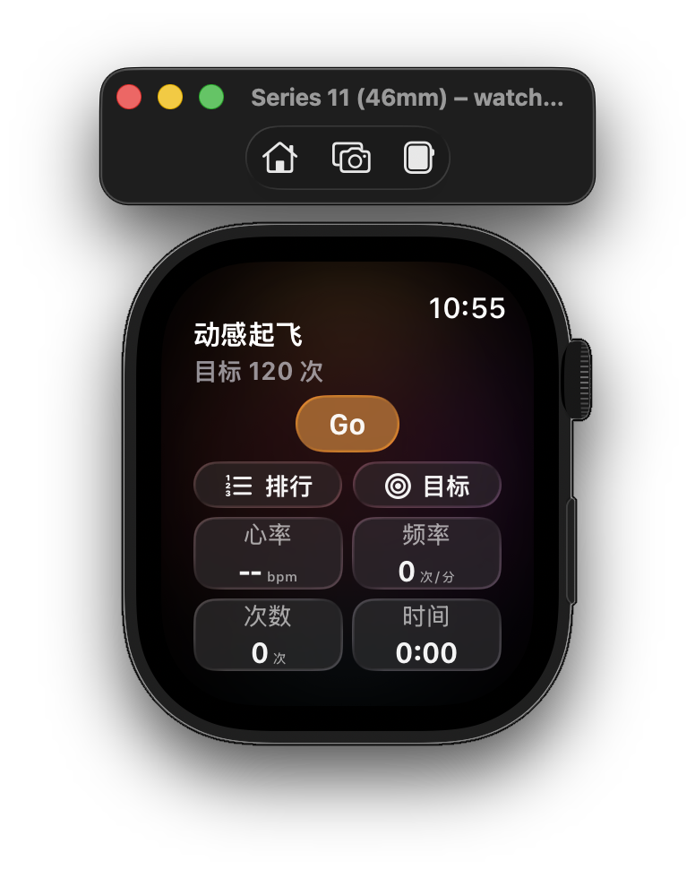

FlyMe now runs natively on Apple Watch, with phone-watch connectivity for seamless syncing. Quick record, full history browsing, and the watch-exclusive Dynamic Takeoff feature are all accessible from your wrist.

## AI Assistant

- Ask for trend summaries and low-pressure next-step suggestions
- Describe past events naturally and review AI-proposed records before saving
- Keep separate conversations, revisit conversation history, and delete old conversations
- Configure SiliconFlow, DeepSeek, or another OpenAI-compatible endpoint
- Store API keys locally in Keychain and choose whether detailed category counts are shared

## Quick Check-ins

- Record six types of moments: urges, successful redirections, masturbation, intimacy, explicit content, and nocturnal emissions
- Add a record immediately from the home screen or backdate it from History
- Receive a distinct full-screen success animation, gentle sound effect, and haptic response after every check-in
- Confirm AI-assisted records before they are written locally

## Self-Discipline Score

- View a continuously updated self-discipline score on the home screen
- Understand how recent behavior, stable days, and successful redirections affect the score
- Open the score card to see the complete scoring explanation
- Follow a separate score trend chart to understand changes over time

## Trends and Insights

- Compare the occurrence counts of all six metrics in a single trend chart
- Select exactly which metrics should appear together
- Switch smoothly between one week, one month, six months, and one year
- Review category distribution and overall recording patterns

## History

- Browse past records using a Chinese-localized calendar
- Inspect any selected day's complete activity
- Switch the 35-day matrix between all six metrics to see daily frequency
- Add past records with the same animated success feedback
- Select, manage, and delete multiple historical records at once

## Privacy and Personalization

- Keep records on the device by default
- Hide sensitive category names throughout the app with Discreet Mode
- Apply Discreet Mode across records, trends, history, score details, AI context, and success feedback
- Enable or disable success sounds and haptic feedback independently
- Manually back up and restore records through a user-selected location, including iCloud Drive

## Apple Watch

- Record all six check-in types directly from your watch
- Browse full history and recent records synced from iPhone
- Quick-record with one tap from the watch home screen
- Automatically syncs recent iPhone records via WatchConnectivity
- Native watchOS SwiftUI interface tuned for the small screen

## Dynamic Takeoff（动感起飞）

- Set a personal frequency goal for masturbation tracking
- Track progress against your goal with animated visual feedback
- Watch-exclusive: log frequency, duration, and time directly on Apple Watch
- View a leaderboard-style ranking of your tracking discipline
- All data stays local and syncs securely between devices

## Design

- Native SwiftUI interface built for iOS 26
- Liquid Glass surfaces, soft aurora colors, and restrained visual depth
- Fluid transitions, scroll-driven motion, and animated chart switching
- Dedicated light and dark mode app icons
- Portrait-focused iPhone experience
