

  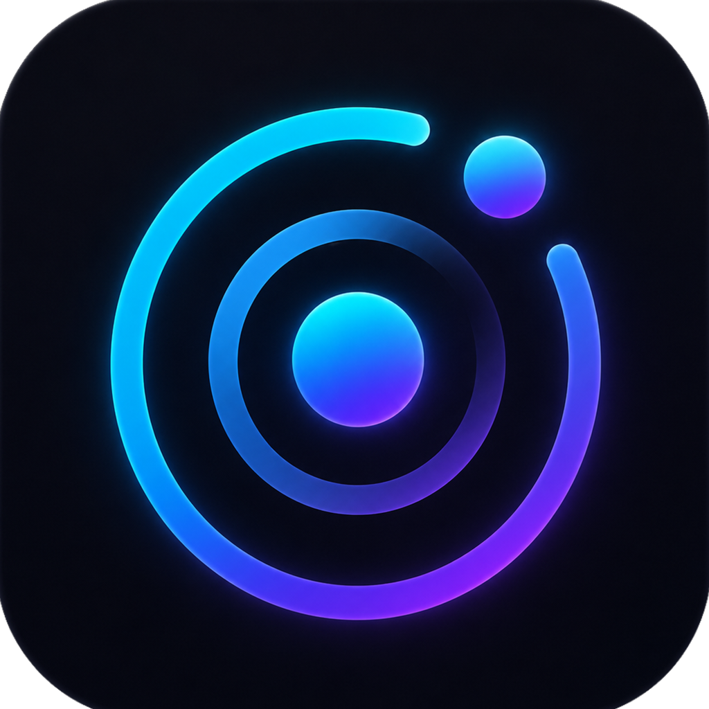
  <h1>FlyMe · 清醒</h1>
  
一款私密、克制且认真设计的 iPhone 自律记录工具。

  

    
    
    
    
  

  

    <a href="README.md">English</a> | 简体中文
  

FlyMe 在应用内显示为 **清醒**，帮助用户觉察行为、理解自己的节奏，并记录每一次更主动的选择。软件以平静克制的 Liquid Glass 界面，整合快速记录、历史回看与趋势分析。

## 界面预览

### 首页与快速记录

  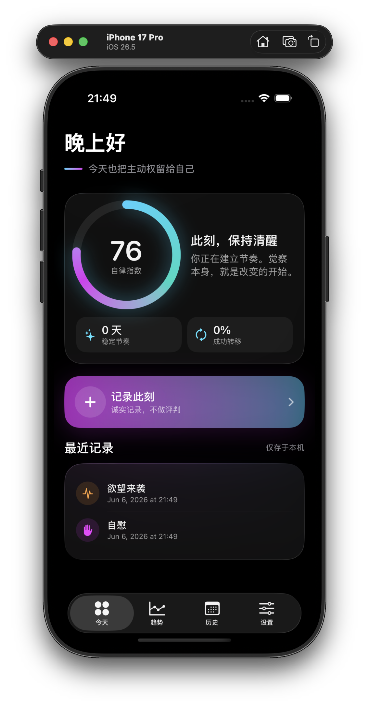
  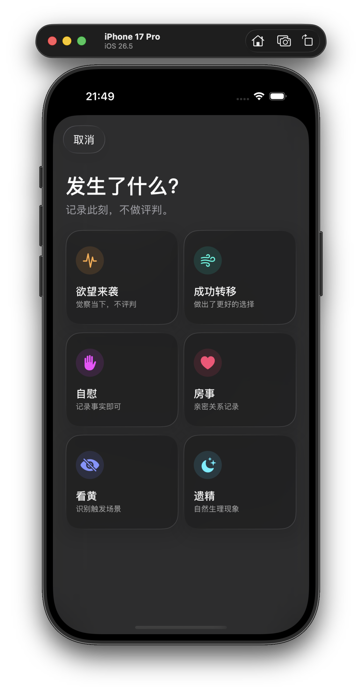

首页集中展示当前自律指数、最近记录和主要记录入口。快速记录界面将六类事件收纳在一个专注、清晰的面板中。

### 全屏成功反馈

  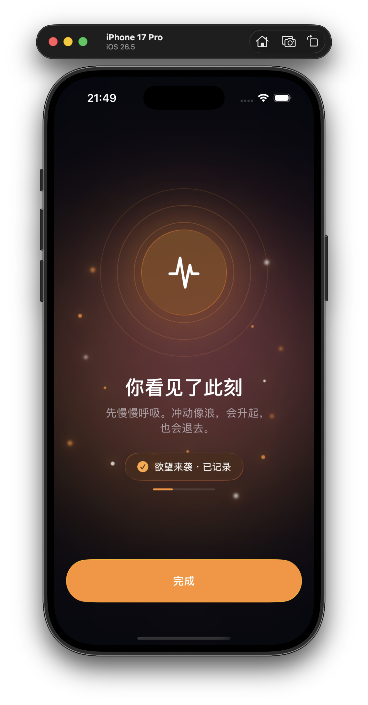
  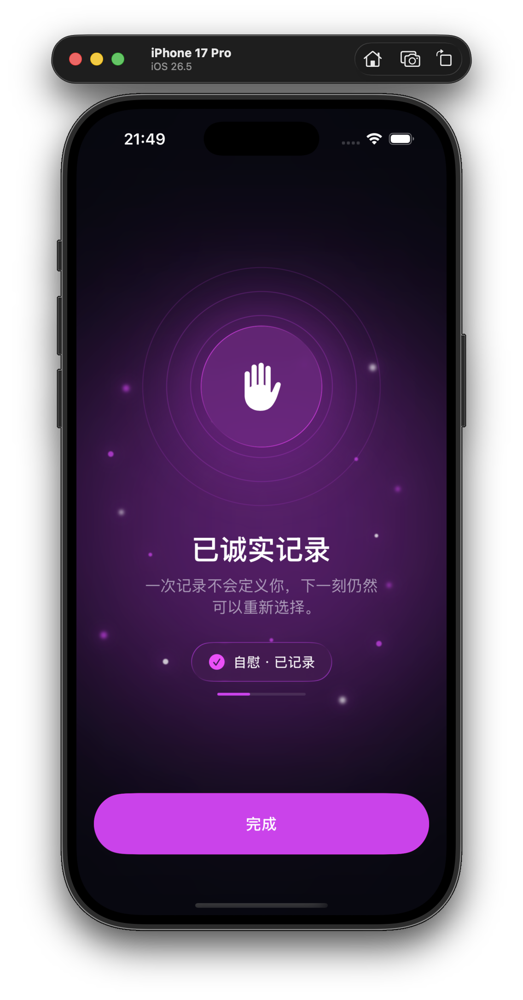

不同记录类型拥有独立的全屏色彩、图标、文案和动效，并配合对应音效与触感反馈。

### 趋势与指数洞察

  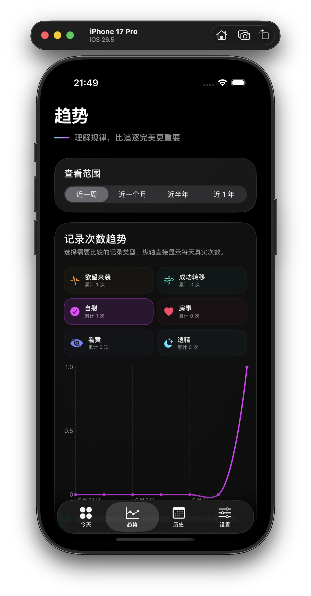
  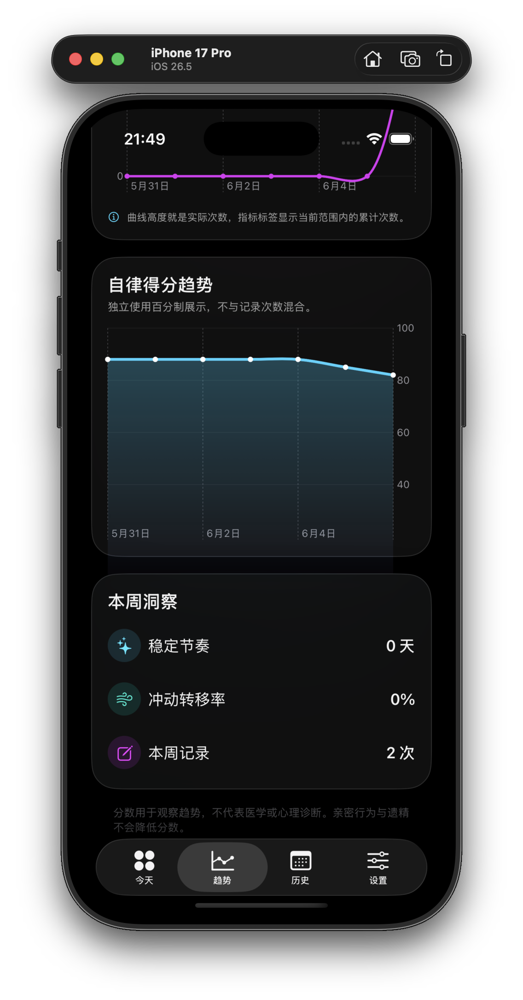

  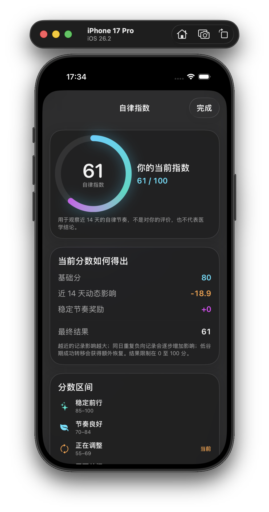

可以对比所选行为指标、查看独立得分趋势，并打开指数说明了解当前分数的完整计算方式。

### 历史与设置

  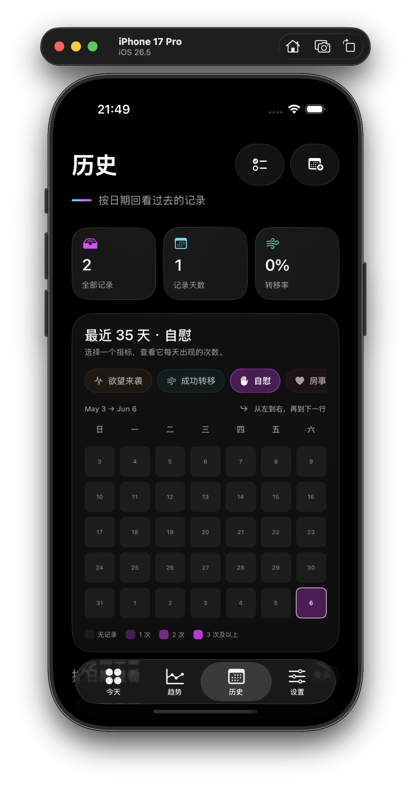
  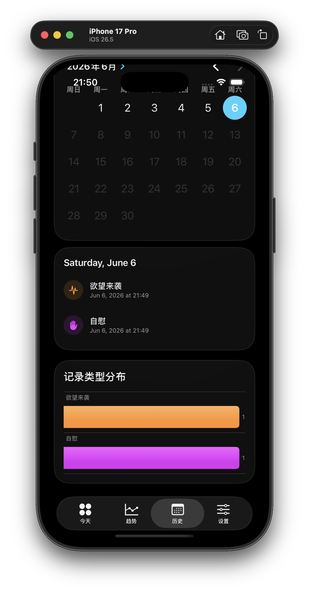

  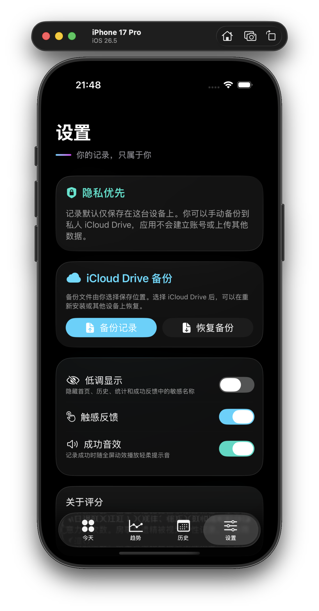

历史页面结合可切换的 35 天指标矩阵与日历回看；设置页面集中管理隐私、反馈偏好和手动备份。

## 快速记录

- 支持记录欲望来袭、成功转移、自慰、房事、看黄和遗精六类事件
- 可以从首页记录此刻，也可以在历史页面补记过去发生的记录
- 每次记录完成后展示独立的全屏成功动效，并播放轻柔音效与触感反馈
- 支持添加备注，保留当时值得回看的信息

## 自律指数

- 在首页持续查看根据记录变化的自律指数
- 指数综合考虑近期行为、稳定天数与成功转移次数
- 点击指数即可查看完整的计算逻辑与评分说明
- 通过独立的得分趋势图观察长期变化

## 趋势与统计

- 在同一张趋势图中对比六项指标的发生次数
- 自由勾选需要同时展示的指标
- 支持近一周、近一个月、近半年与近一年范围切换
- 查看不同记录类型的数量分布与整体记录情况

## 历史回看

- 使用中文日期选择器回看过去记录
- 查看任意日期下的完整记录
- 在最近 35 天矩阵中切换六项指标，直观看到每天的发生频率
- 补记过去记录时同样展示完整成功动效
- 集中选择、管理与批量删除历史记录

## 隐私与个性化

- 默认将记录保存在设备本地
- 开启低调显示后，在软件各处隐藏敏感记录名称
- 可以分别开启或关闭成功音效与触感反馈
- 支持手动备份与恢复记录，可自行选择 iCloud Drive 等保存位置

## 视觉设计

- 使用原生 SwiftUI 为 iOS 26 构建
- 采用 Liquid Glass、朦胧极光色彩与克制的空间层次
- 包含自然的页面转场、滚动动效与图表切换动画
- App 图标自动适配浅色与深色模式
- 专注于 iPhone 竖屏使用体验
